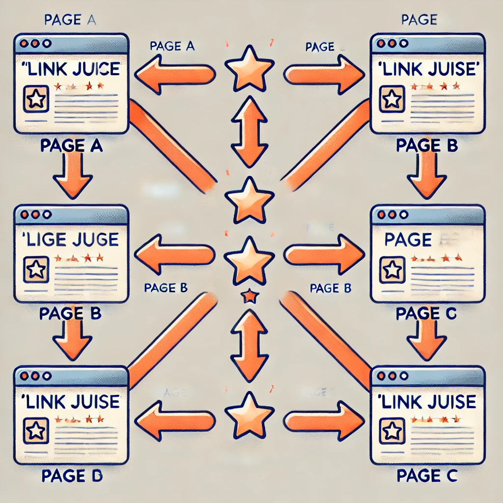

# Qué es una etiqueta `<a></a>` en HTML?

## 1. ¿Qué es la etiqueta `<a>`?

La etiqueta `<a>` en HTML, conocida como "anchor tag" o etiqueta de anclaje, se utiliza para crear enlaces en una página web. Estos enlaces pueden dirigir a otras páginas web, archivos, correos electrónicos o incluso a una ubicación específica dentro de la misma página. Es una de las etiquetas más importantes para la navegación en la web.

Un ejemplo básico de una etiqueta `<a>` es el siguiente:

```html
<a href="https://www.tusitio.com">Nuestra página principal</a>
```

En este ejemplo, el enlace llevará a los usuarios a [https://www.tusitio.com](https://www.tusitio.com) cuando hagan clic en "Nuestra página principal".

## 2. ¿Dónde se utilizan las etiquetas de anclaje `<a>` en HTML?

Las etiquetas de anclaje `<a>` se utilizan en múltiples contextos dentro de una página web para mejorar la navegación y la experiencia del usuario:

- **Enlaces a otras páginas web**: Permiten dirigir a los usuarios a páginas externas o internas dentro del mismo sitio.
- **Enlaces a archivos**: Facilitan la descarga o acceso a documentos y recursos como PDF, imágenes, etc.
- **Enlaces de correo electrónico**: Se pueden usar para abrir el cliente de correo predeterminado con un mensaje predefinido.
- **Enlaces internos**: Ayudan a navegar dentro de una misma página, como en índices o menús de contenido.

Estas etiquetas son esenciales para crear una estructura de navegación efectiva en cualquier sitio web.

## 3. Componentes de una etiqueta `<a>` en HTML

La etiqueta `<a>` en HTML es esencial para la creación de enlaces y consta de varios componentes clave que determinan su comportamiento y funcionalidad:

- **Etiqueta de apertura `<a>`**: Es el punto de partida de la etiqueta y siempre incluye el atributo `href`, que define la URL o destino del enlace.
  
- **Atributo `href`**: Este atributo es el más importante de la etiqueta `<a>`. Especifica la dirección a la que el enlace llevará al usuario. Puede ser un enlace absoluto, que incluye la URL completa, o un enlace relativo, que se basa en la ubicación actual del documento.

- **Atributo `target`**: Controla cómo se abrirá el enlace. Por ejemplo, `target="_blank"` abrirá el enlace en una nueva pestaña o ventana del navegador, mejorando la experiencia del usuario cuando se dirigen a enlaces externos. Si la etiqueta `<a>` no contiene un valor para el atributo `target`, por defecto se utilizará el valor `_self`, que abre el recurso enlazado en el mismo marco o pestaña.

- **Atributo `rel`**: Este atributo define la relación entre la página actual y la página enlazada. Es particularmente útil en términos de SEO y seguridad. Aquí algunos valores importantes para el atributo `rel`:
  - **nofollow**: Indica a los motores de búsqueda que no deben transferir autoridad o "link juice" desde la página actual a la página enlazada.
  - **noopener**: Una medida de seguridad que evita que el recurso enlazado tome control de la página actual cuando se abre en una nueva pestaña o ventana.
  - **noreferrer**: Prohíbe que el recurso enlazado identifique la página actual como fuente de tráfico, lo que afecta cómo se categoriza el tráfico en herramientas de análisis como Google Analytics. Además, también aplica las medidas de seguridad de `noopener`.

- **Texto del enlace**: Es el texto visible que los usuarios verán y sobre el cual harán clic. Es crucial que este texto sea descriptivo y relevante para proporcionar una buena experiencia de usuario y mejorar la accesibilidad.

- **Etiqueta de cierre `</a>`**: Cierra la etiqueta de anclaje y delimita el final del texto del enlace. Todo lo que esté dentro de las etiquetas de apertura y cierre será clicable.

Estos componentes trabajan juntos para definir cómo y a dónde llevará al usuario el enlace, lo que hace que la etiqueta `<a>` sea fundamental para la interactividad y la navegación dentro de una página web.

## 4. Etiquetas HTML `<a>` vs. etiquetas HTML `<link>`

Las etiquetas `<a>` y `<link>` son fundamentales en HTML, pero se utilizan en diferentes contextos y para distintos propósitos. A continuación, se presenta una tabla que resume las diferencias clave entre ambas:

| Característica         | `<a>` Tag                                       | `<link>` Tag                                      |
|------------------------|-------------------------------------------------|---------------------------------------------------|
| **Propósito principal** | Crear enlaces clicables para navegar a otras páginas, archivos, correos electrónicos, o secciones dentro de la misma página. | Vincular recursos externos como hojas de estilo CSS, iconos, o fuentes a la página web. |
| **Visibilidad**        | El contenido entre las etiquetas `<a>` es visible y clicable por el usuario. | No es visible para el usuario; trabaja en segundo plano. |
| **Atributos clave**    | `href`, `target`, `rel`                         | `href`, `rel`, `type`                             |
| **Contexto de uso**    | Se utiliza dentro del cuerpo (`<body>`) de un documento HTML. | Se utiliza dentro del encabezado (`<head>`) de un documento HTML. |
| **Interactividad**     | Proporciona interactividad, permitiendo a los usuarios hacer clic en enlaces. | No interactúa con el usuario directamente; gestiona la vinculación de recursos. |

Las etiquetas `<a>` se enfocan en la navegación y la interacción del usuario, mientras que las etiquetas `<link>` gestionan la inclusión de recursos externos que afectan el estilo o el comportamiento del documento HTML.

## 5. ¿Cuáles son los beneficios de usar etiquetas de anclaje?

Las etiquetas de anclaje `<a>` en HTML ofrecen varios beneficios importantes:

- **Mejora de la navegación**: Facilitan a los usuarios moverse entre diferentes páginas, secciones, o recursos, creando una experiencia de usuario fluida y eficiente.
  
- **Optimización para motores de búsqueda (SEO)**: Los enlaces internos y externos ayudan a los motores de búsqueda a rastrear y entender la estructura de un sitio web, mejorando la visibilidad en los resultados de búsqueda.

  - **Transmitir "Link Juice" a través de enlaces internos**: Los enlaces internos permiten distribuir la autoridad de tu sitio (conocido como "link juice") a través de las diferentes páginas, ayudando a mejorar el ranking general de tu sitio en los motores de búsqueda. Al enlazar estratégicamente páginas dentro de tu propio sitio, puedes fortalecer la relevancia y autoridad de contenido específico.
  <br>

  
  <p align="center"><i>Diagrama de cómo se distribuye el Link Juice</i></p><br>

- **Accesibilidad**: Al proporcionar un texto de enlace descriptivo, las etiquetas de anclaje mejoran la accesibilidad para usuarios con discapacidades, quienes pueden utilizar lectores de pantalla para navegar por los enlaces.

- **Experiencia del usuario**: Los enlaces bien ubicados y relevantes pueden mejorar significativamente la experiencia del usuario al proporcionar acceso directo a información relacionada o recursos adicionales.

- **Control de tráfico**: Puedes dirigir a los usuarios hacia contenido clave o llamadas a la acción específicas, lo que es útil para estrategias de marketing o conversión.

El uso adecuado de las etiquetas de anclaje no solo mejora la usabilidad de un sitio web, sino que también contribuye a su eficacia en términos de SEO, accesibilidad y distribución de autoridad.

## 6. Cómo detectar y corregir problemas con enlaces

Mantener enlaces saludables en un sitio web es crucial para la experiencia del usuario y para el SEO. Aquí te explico cómo puedes detectar y corregir problemas comunes con enlaces:

- **Detección de enlaces rotos**: Los enlaces rotos pueden llevar a una mala experiencia de usuario. Herramientas como Google Search Console o Screaming Frog pueden ayudarte a identificar estos enlaces en tu sitio.
  
- **Corrección de enlaces rotos**: Una vez que hayas identificado un enlace roto, corrígelo actualizando la URL, redirigiendo a una página válida o eliminando el enlace si ya no es relevante.

- **Optimización de enlaces internos**: Revisa tus enlaces internos para asegurar que estén bien distribuidos y que estén pasando el "link juice" de manera efectiva. Además, asegúrate de que los enlaces estén bien contextualizados dentro del contenido.

- **Validación de enlaces externos**: Verifica regularmente los enlaces externos para asegurarte de que aún dirigen a contenido relevante y de alta calidad. Si encuentras enlaces a sitios que ya no existen o que han cambiado de temática, es recomendable actualizarlos o eliminarlos.

Mantener los enlaces en buen estado es fundamental para evitar errores 404, mejorar el ranking en los motores de búsqueda y asegurar que los usuarios tengan una navegación fluida en tu sitio web.

### Referencias

1. **Guía sobre la etiqueta `<a>` en HTML**  
   Semrush. [HTML Anchor Element: A Simple Guide for Beginners](https://www.semrush.com/blog/html-a-tag/).

2. **Documentación sobre la etiqueta `<a>`**  
   MDN Web Docs. [HTML `<a>` Element](https://developer.mozilla.org/es/docs/Web/HTML/Element/a).

3. **Prácticas recomendadas para enlaces internos y SEO**  
   Moz. [Internal Links: What They Are and How to Use Them](https://moz.com/learn/seo/internal-link).
